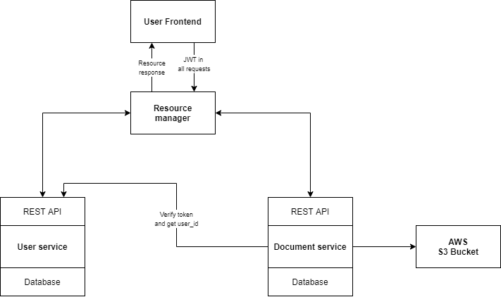

# noted-resource-manager

[](https://travis-ci.org/jsgilberto/noted-resource-manager)
[](https://github.com/agconti/cookiecutter-django-rest)

A resource manager for the noted app. This service is similar to what an API Gateway would do, it acts as the front door of the remaining services (users and documents). The intention here is that this service decides which services are available in the background and selects which endpoints from these services are available for the public. It means that there are public endpoints and private endpoints. Public endpoints are available to use from the resource manager service but on the other hand, private endpoints are only available to use from other internal services.

### How does it work
All requests for public endpoints are tunneled to the requested resource. For instance, if you would like to authenticate in the front end, you would have to use the users service, but the clients only have acces to the users service through the resource manager service.



# Prerequisites

- [Docker](https://docs.docker.com/docker-for-mac/install/)  

# Local Development

Start the dev server for local development:
```bash
docker-compose up
```

Run a command inside the docker container:

```bash
docker-compose run --rm web [command]
```


This resource manager is used to normalize the API calls from the front end. For example, if one of the APIs version change, we only have to change
logic inside the resource manager and never on the front end.

It also serves as the entrypoint for all the remaining resources, being the only service exposed to the public.
